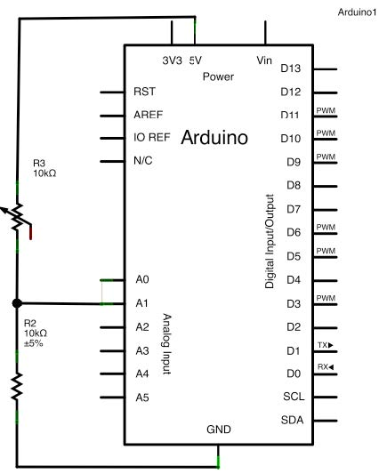

# Project 1: Device Programming and Cyclic Scheduler
By Luis Daniel Casais Mezquida & Juan Carlos Cebrián Peñuela  
Real Time Systems 22/23  
Bachelor's Degree in Computer Science and Engineering, grp. 89  
Universidad Carlos III de Madrid  

## Problem statement
The objective is to build the electronic system of a wagon controlled by computer from a external server. The wagon mission is to carry concrete inside a mine. To move across the mine the wagon has a railway along the ground.  
The system must include the automatic handling of the wagon lamps, a system to automaticaly handle stops to load/unload the concrete, and an emergency mode in case there is a failure accomplishing the deadlines of main control server tasks.

### 1. Characteristics of the environment to control
On one hand, the railway allows forgetting the friction, this way; on flat ground the wagon keeps it speed. But on the other hand, when the wagon faces steep ground, it suffers acceleration or deceleration depending the slope is up or down. The following table shows the speed changes due to the ground.  

| GROUND | ACCELERATION |
|:------:|:------------:|
|  Flat  |    0 m/s2    |
|   Up   |  -0.25 m/s2  |
|  Down  |   0.25 m/s2  |

<!-- Thanks to https://www.tablesgenerator.com/markdown_tables -->

The system includes a GPS that lets to know in advance if the ground will be flat, or it will contain an up or down slope in the following few meters.  

To keep the wagon in control as it advance along the rail as fast a possible, it is necessary to maintain the speed near 55 m/s. Any speed between 40 m/s and 70 m/s is considered safe.  

To control the speed, the wagon includes a accelerator mechanism that allows to increment speed at 0.5 m/s2. Furthermore, it includes a brake mechanism that allows reducing the speed at 0.5 m/s2.  

More than that, the wagon includes a concrete deposit with a mixer that avoid the concrete to solidify; the concrete must be removed with the mixer at least for 30 seconds in a row. After that it can be left to rest as much as 60 seconds before removing it again.  

On the other side the mixer engine cannot be turn on more that 60 consecutive seconds and, once deactivated, it must left inactive at least 30 seconds before turning on again.  

There are ark zones where is necessary to activate the wagon lamps to get visibility. Those lamps should activate automatically when dark is detected and deactivated when light bright.  

The objective is to activate the lamps as soon as entering on a dark zone. At the same time they must be deactivated as soon as this zone is leaved. If there is no changes their state should not be modify. The system should answer to the changes as soon as possible, but at least it should answer before 12 seconds.  

There is the inclusion of concrete deposits where to unload part of the concrete. The wagon should detect the proximity of the deposit and should reduce its speed until stopping under the deposit. After that it should wait until the download is finished and then it will resume its speed.

### 1.1 Sensors

The components to control are:
- Light sensor: Detect if the environment is dark enough to switch on the lamps or not.
- Lamps: Activated the allow visibility on dark zones. They must be deactivate on open ground to save energy.
- GPS: indicates the distance to the next deposit.
- A sensor placed on the deposit is included to indicate when the download process is over. 

### 1.2 Execution modes

The system should execute normally until the distance to the deposit is been reduced to the minimum acceptable. In this moment the execution mode should be changed to start the braking mode. This process includes changes compared to the normal mode:
- The process of adjusting the speed should double its frequency to ease the braking precision.
- The lamps should be continuously be switched on (no need to check the light sensor).
- The mixer should work as before.

The braking process ends when the distance to the deposit is 0 and the speed is less than 10 m/s (Otherwise the download won’t happen). In this moment, the emergency brake of the deposit stops the wagon (no matter the state of the accelerator or the brake) and the execution mode changes to start the download process. In this mode the changes are the following:
- The end of the download must be detected. This must be checked with greatest frequency possible.
- There is no need to check the speed or slope, and there is no need to activate the brake or the accelerator.
- Lamps must be switched on constanly to indicate that the wagon is stopped. (no need to check the light sensor).
- The mixer should work as before.
- As soon the download ends the brake and the accelerator would work again and the system should go back to normal mode.

In this system the functions to access the display can suffer sporadic delays bigger than its expected computing time. In cases a failure of the response times happens. The main control system should change to an emergency mode
that includes:
- The wagon must stop. Thus, the brake must be constantly activated and the accelerator must be deactivated.
- The lamps must be constantly switched on to indicate an emergency state.
- The mixer should work as before.
- The wagon electronic system must be warned to enter in an equivalent emergency state.

### 2. Definition of the controlling system
The control system is designed as two main differentiated pieces:
- The electronic control system installed on the wagon.
- The main control system installed on an autonomous system on the control center.

Both systems communicate using a standard UART over USB serial connection.

### 2.1 Definition of the electronic control system installed on the wagon
The control system of the wagon includes several sensors and actuators in order to receive information of the environment and to interact with it.  

The hardware of the electronic system includes an Arduino UNO microcontroller board. The sensor and actuators are described next.

### 2.1.1. Reading the light sensor
The acceleration system must be implemented using a LED that turns on when the accelerator is activated and turns off otherwise. The circuit schema required is the following:  

A periodic task must be programmed on the microcontroller that checks the value that the accelerator should have on every period, and that activates and deactivates the LED accordingly. The student should choose an appropriate value for the period.

### 2.1.2. Activation/deactivation of the brake system
The brake system must be implemented using a LED that turns on when the brake is activated and turns off otherwise. The circuit schema required is the following:

A periodic task must be programmed on the microcontroller that checks the value that the brake should have on every period, and that activates and deactivates the LED accordingly. The student should choose an appropriate value for the period.

### 2.1.3. Activation/deactivation of the mixer system
The brake system must be implemented using a LED that turns on when the brake is activated and turns off otherwise. The circuit schema required is the following:

A periodic task must be programmed on the microcontroller that checks the value that the mixer should have on every period, and that activates and deactivates the LED accordingly. The student should choose an appropriate value for the period.

### 2.1.4. Reading of the railway slope
The system to pickup the value of the slope is implemented using a three-position switch (or three DIP switches) that the student can activate. The circuit schema required is the following:

A periodic task must be programmed on the microcontroller that checks the value of every position of the switch and then obtain the current slope (it is only valid when there is only one value for the slope). The microcontroller only consider the up and down notifications. The flat ground is represented as the absence of up and down ground. The student should choose an appropriate value for the period.

### 2.1.5. Showing the current speed
The brake system must be implemented using a LED that varies it brightness depending on the current speed. The LED should turn off at a speed of 40 m/s and should reach the maximum bright at 70 m/s. The circuit schema required is the following.

A periodic task must be programmed on the microcontroller that calculates periodically the correct value of the speed and represents it varying the LED brightness. The student should choose an appropriate value for the period.

### 2.1.6. Reading the ambient light
The ambient light sensor is implemented using a Light Dependent Resistor (LDR). The schema of the requested circuit is the following:  

A periodic task must be programmed on the microcontroller that checks periodically the correct value of the sensor. The student should choose an appropriate value for the period.

### 2.1.7. Activation/deactivation of the lamps
The lamps must be implemented using a LED that turns on when the lamps are switch on and turns off otherwise. The circuit schema required is the following.

A periodic task must be programmed on the microcontroller that checks periodically the correct value the lamps should have and that activate or deactivate the LED accordingly. The student should choose an appropriate value for the period

### 2.1.8. Implementation of the communication server

The Arduino microcontroller should include a task that, periodically each 200 miliseconds, checks if a request has been received from the main control server. In that case, it should perform the correct action and send the right answer.  

Both the sending messages and the receiving messages should be composed by 9 characters (including the end of line). That allows detecting when a complete message is being received before beginning to read it.  

There are two possible kind of commands that can be received from the main control system.  

1. Request to read the value of a sensor.  
In this case the main control system sends a request message (`REQ`) pointing the sensor it wants to access. The communication server sends back a message with the current value of the sensor stored in the Arduino memory.
2. Request to activate a hardware component.  
In this case, the main control system sends a request message pointing the HW component it wants to activate (`SET`) or deactivate (`CLR`). The communication server keeps the command in its memory so the corresponding tasks will preform it and sends back an `OK` message.

In case the message sent by the main control system can be understood or there is any kind of error, the communication server sends an error message.  

The following table includes all the messages of the protocol for each task:  

|          Request          |    Request message   |    Answer message    |   Error message   |
|:-------------------------:|:--------------------:|:--------------------:|:-----------------:|
|   Activating Accelerator  |   `GAS:<SP>SET<CR>`  | `GAS:<SP><SP>OK<CR>` | `MSG:<SP>ERR<CR>` |
|  Deactivating Accelerator |   `GAS:<SP>CLR<CR>`  | `GAS:<SP><SP>OK<CR>` | `MSG:<SP>ERR<CR>` |
|      Activating Brake     |   `BRK:<SP>SET<CR>`  | `BRK:<SP><SP>OK<CR>` | `MSG:<SP>ERR<CR>` |
|     Deactivating Brake    |   `BRK:<SP>CLR<CR>`  | `BRK:<SP><SP>OK<CR>` | `MSG:<SP>ERR<CR>` |
|      Activating Mixer     |   `MIX:<SP>SET<CR>`  | `MIX:<SP><SP>OK<CR>` | `MSG:<SP>ERR<CR>` |
|     Deactivating Mixer    |   `MIX:<SP>CLR<CR>`  | `MIX:<SP><SP>OK<CR>` | `MSG:<SP>ERR<CR>` |
|       Reading Slope       |   `SLP:<SP>REQ<CR>`  | `SLP:<SP><SP>UP<CR>` | `MSG:<SP>ERR<CR>` |
|                           |                      |    `SLP:DOWN<CR>`    | `MSG:<SP>ERR<CR>` |
|                           |                      |    `SLP:FLAT<CR>`    | `MSG:<SP>ERR<CR>` |
|       Reading Speed       |   `SPD:<SP>REQ<CR>`  |    `SPD:00.0<CR>`    | `MSG:<SP>ERR<CR>` |
|    Reading light sensor   |   `LIT:<SP>REQ<CR>`  |   `LIT:<SP>00%<CR>`  | `MSG:<SP>ERR<CR>` |
|      Activating Lamps     |   `LAM:<SP>SET<CR>`  | `LAM:<SP><SP>OK<CR>` | `MSG:<SP>ERR<CR>` |
|     Deactivating Lamps    |   `LAM:<SP>CLR<CR>`  | `LAM:<SP><SP>OK<CR>` | `MSG:<SP>ERR<CR>` |
|   Reading if it’s moving  |   `STP:<SP>REQ<CR>`  | `STP:<SP><SP>GO<CR>` | `MSG:<SP>ERR<CR>` |
|                           |                      |    `STP:STOP<CR>`    | `MSG:<SP>ERR<CR>` |
|      Reading distance     | `DS:<SP><SP>REQ<CR>` |    `DS:00000<CR>`    | `MSG:<SP>ERR<CR>` |
| Activating emergency mode | `ERR:<SP>SET<CR>`    | `ERR:<SP><SP>OK<CR>` | `MSG:<SP>ERR<CR>` |

<!-- Thanks to https://www.tablesgenerator.com/markdown_tables -->

---

Their behavior depends of the execution mode active on each moment.
The modes are the following:

### 2.1.9. Distance selection mode
This mode applies some specific tasks:  

### 2.1.9.1. Selector for the deposit distance
The light sensor is implemented using a Potentiometer to read the distance value. The schema of the requested circuit is the following:

A periodic task must be programmed on the microcontroller that stores periodically the actual value of the sensor. Value should be ranged between 10000 and 90000 meters. The student should choose an appropriate value for the period.  

### 2.1.9.2. Display for the selected distance
A 7-segments display with common cathode is used along with a CD4511 chip to translate from binary to 7-segments signals. The circuit schema is the following:  

A periodic task must be programmed on the microcontroller that writes on the display the most recent value read by the distance selector (in tens of thousands of meters). The student should choose an appropriate value for the period.

### 2.1.9.3. Validation of the distance to the deposit
The system to validate the distance to the deposit is implemented using a push-button that validates the current value of the distance selector as the actual distance. The circuit schema is the following:  

A periodic task must be programmed on the microcontroller that checks when the button has been activated (pushed and released). In that moment the current value of the distance selector stored in memory is selected as the actual distance. Furthermore, the system changes to the approach mode. The student should choose an appropriate value for the period.

### 2.1.10. Approach mode
This mode applies some specific tasks:  

### 2.1.10.11. Display for the actual distance
The display for the actual distance calculates (using the current speed) which is the current distance to the deposit. If the distance is equal or less than 0 and the speed is equal or less than 10 m/s, then the distance is changed to 0 and the system changes to the stop mode. If the distance is equal or less than 0 and the speed is bigger than 10 m/s, then the system changes to the Distance selection mode.  

The used hardware is the same used for the Display for the selected distance task.  

A periodic task must be programmed on the microcontroller for this task. The student should choose an appropriate value for the period.

### 2.1.11. Stop mode
This mode applies some specific tasks and modifies other ones:  

### 2.1.11.1. Modifying of Reading the current speed
In this mode the speed should be always 0, whatever happen.  

A periodic task must be programmed on the microcontroller for this task. The student should choose an appropriate value for the period.

### 2.1.11.2. Reading end of stop
This task uses the same hardware (the push-button) used for the task of Validation of the distance to the deposit. When the button is activated (pushed and released) the system should change to the Distance selection mode.  

A periodic task must be programmed on the microcontroller for this task. The student should choose an appropriate value for the period.

### 2.1.12. Emergency mode
On this mode the system works with the lamps, slope, and mixer tasks.  
Furthermore, the lamps task is modified to switch them on continuously, the accelerator task to be deactivated all the time and the brake task to be always activated.

### 2.2. Definition of the main control system
The main control system is in charge of getting the data from the wagon electronic system, taking the corresponding decisions and sending back the actuation requests to the wagon. The main control system and the wagon are connected by an UART over USB serial connection.  

Furthermore, the main control system includes a display to show on the screen the current state of the system. The display is accessible through a set of functions calls.  

The tasks the system should perform are the following:

### 2.2.1. Reading the current slope
The main control system should implement a periodic task that sends a request to the wagon for receiving the current value of the slope. Once received, the task should show the slope on the display using the corresponding function.  

The period for this task should be equal to 10 seconds.

### 2.2.2. Reading the current speed
The main control system should implement a periodic task that sends a request to the wagon for receiving the current value of the speed. Once received, the task should show the speed on the display using the corresponding function.  

The student should calculate the correct period for this task.

### 2.2.3. Activating the accelerator
The main control system should implement a periodic task that calculates, using the data received, if the accelerator must be activated or not. Once done, it should send a request to the wagon for activating or deactivating the accelerator. Once received, the task should show if the accelerator is activated or not on the display using the corresponding function.

The student should calculate the correct period for this task.

### 2.2.4. Activating the brake
The main control system should implement a periodic task that calculates, using the data received, if the brake must be activated or not. Once done, it should send a request to the wagon for activating or deactivating the brake. Once received, the task should show if the brake is activated or not on the display using the corresponding function.

The student should calculate the correct period for this task.

### 2.2.5. Activating the mixer
The main control system should implement a periodic task that calculates, using the data received, if the mixer must be activated or not. Once done, it should send a request to the wagon for activating or deactivating the mixer. Once received, the task should show if the mixer is activated or not on the display using the corresponding function.

The student should calculate the correct period for this task.

### 2.2.6. Reading the current speed
The main control system should implement a periodic task that sends a request to the wagon for receiving the current value of the light sensor. This value should be received as a percentage between 0% and 99% and it should be shown on the display using the corresponding function.  

The student should calculate the correct period for this task.

### 2.2.7. Activating/deactivating the lamps
The main control system should implement a periodic task that calculates, using the data received, if the lamps must be activated or not (the light threshold must be 50%) . Once done, it should send a request to the wagon for activating or deactivating the lamps. Once received, the task should show if the lamps are activated or not on the display using the corresponding function.  

The student should calculate the correct period for this task.

### 2.2.8. Reading the movement state of the wagon
The main control system should implement a periodic task that sends a request to the wagon for receiving the current value of the movement state of the wagon (moving or stopped). This value should be shown on the display using the corresponding function.  

The student should calculate the correct period for this task.

### 2.2.9. Summary of the execution modes for the main control system
As in the electronic control system, the main control system will have several execution modes:

### 2.2.9.1 Normal mode
The task for this mode are the following:
- Read slope
- Read speed
- Read distance
- Turn on/off accelerator
- Turn on/off brake
- Read light sensor
- Turn on/off lamps

### 2.2.9.2 Breaking mode
This mode reduce to the half the period of the speed related tasks and it also removes the light sensor leaving the lamps on. In summary, the task for this mode are the following:
- Read slope.
- Read speed.
- Read distance.
- Turn on/off accelerator.
- Turn on/off brake.
- Turn on/off mixer.
- Turn on lamps.

### 2.2.9.3 Stop mode
This mode puts the wagon to wait until de loading process ends and it frees the wagon. Therefore it must add the task of reading the movement sensor. The task that are speed related are not needed and the lamps must be on. In summary, the task for this mode are the following:
- Read movement state sensor
- Turn on/off mixer.
- Turn on lamps.

### 2.2.9.4 Emergency mode
The main control system should implement the emergency mode, executing the following tasks:
- Read slope.
- Read speed.
- Read distance.
- Turn off accelerator.
- Turn on brake.
- Turn on/off mixer.
- Turn on lamps.
- Activate Emergency mode on Arduino.

---

The functions to access the display of the main control server are the following:  

|    COMPONENT    |             FUNCTION             | COMPUTING TIME |
| --------------- | -------------------------------- | -------------- |
| Slope           | `displaySlope(int slope)`        |   0.5 seconds  |
| Speed meter     | `displaySpeed(double speed)`     |   0.5 seconds  |
| Accelerator     | `displayGas(int gas)`            |   0.5 seconds  |
| Brake           | `displayBrake(int brake)`        |   0.5 seconds  |
| Mixer           | `displayMix(int mixer)`          |   0.5 seconds  |
| Light sensor    | `displayLightSensor(int isDark)` |   0.5 seconds  |
| Lamps           | `displayLamps(int light)`        |   0.5 seconds  |
| Distance        | `displayDistance(int distance)`  |   0.5 seconds  |
| End of the stop | `displayStop(int Stop)`          |   0.5 seconds  |

<!-- Thanks to https://www.tablesgenerator.com/markdown_tables -->

## Implementation

We implemented this project using an Arduino UNO microcontroller for the hardware module (electronic control system installed on the wagon) and RTMS OS for the software module (main control system installed on an autonomous system on the control center).
<!-- TODO: expand this shit -->

### Hardware module

The pinout is:  

|     COMPONENT     | PIN |
| ----------------- | --- |
| `GAS_LED`         | D13 |
| `BRK_LED`         | D12 |
| `MIX_LED`         | D11 |
| `SPD_LED`         | D10 |
| `LAM_LED`         | D7  |
| `DOWN_SLP_SWITCH` | D9  |
| `UP_SLP_SWITCH`   | D8  |
| `STP_BUTTON`      | D6  |
| `DISP_A`          | D2  |
| `DISP_B`          | D3  |
| `DISP_C`          | D4  |
| `DISP_D`          | D5  |
| `PHOTORESISTOR`   | A0  |
| `POTENTIOMETER`   | A1  |

<!-- Thanks to https://www.tablesgenerator.com/markdown_tables -->

For implementation in [Tinkercad](https://www.tinkercad.com/), set `MESSAGE_SIZE` to `7`, and replace the commented lines by the uncommented ones above them in `comm_server()`.

### Software module

## Execution

### Hardware module
1. Setup the circuit on an Arduino UNO as in the [previous image](#hardware-module)
2. Download the [Arduino IDE](https://www.arduino.cc/en/software)
3. Open the `arduino_code/arduino_code.ino` file in Arduino IDE
4. Plug in the microcontroller
5. "Flash" (Compile and upload) the code

You can see the execution online in [Tinkercad](https://www.tinkercad.com/things/kMd5OFdTTyr?sharecode=0-_kDrg5C7xgWkJY8IQwxa2eKNZPFR-1j0ds98lbFmw).

### Software module
